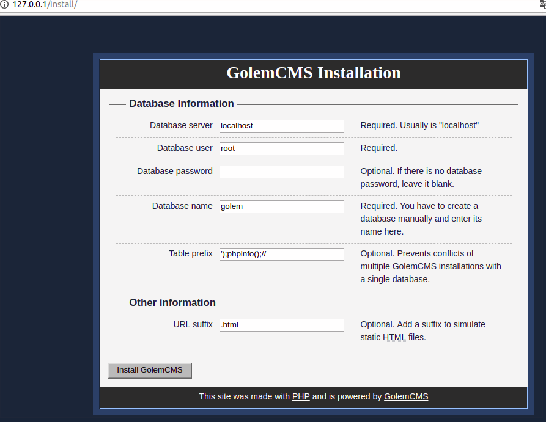
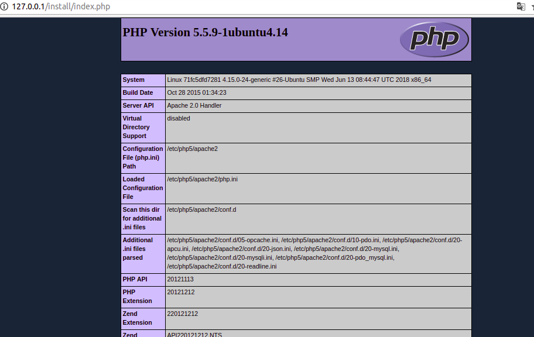
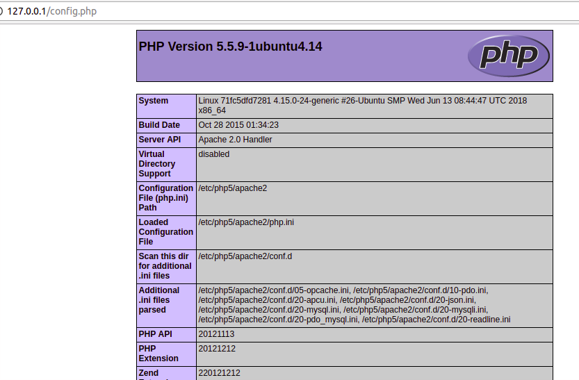

app: https://github.com/ciptard/golemcms 

golemcms 001 

when people forget remove install folder ,attacker can reinstall the application.

0x001 access http://127.0.0.1/install/ and Fill out the form . you can change what you want to change 

 

but you should have the mysql password

0x002 anyway you can download default sql file by access to http://127.0.0.1/install/install.sql

0x003 you can fill `');phpinfo();//`  into `Table prefix` form and Click install GolemCMS and you will see the `config.php` file 

