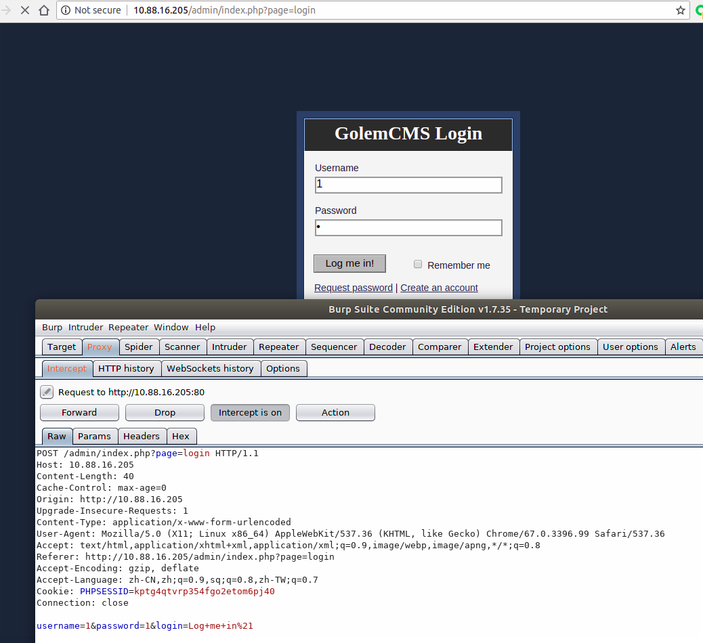
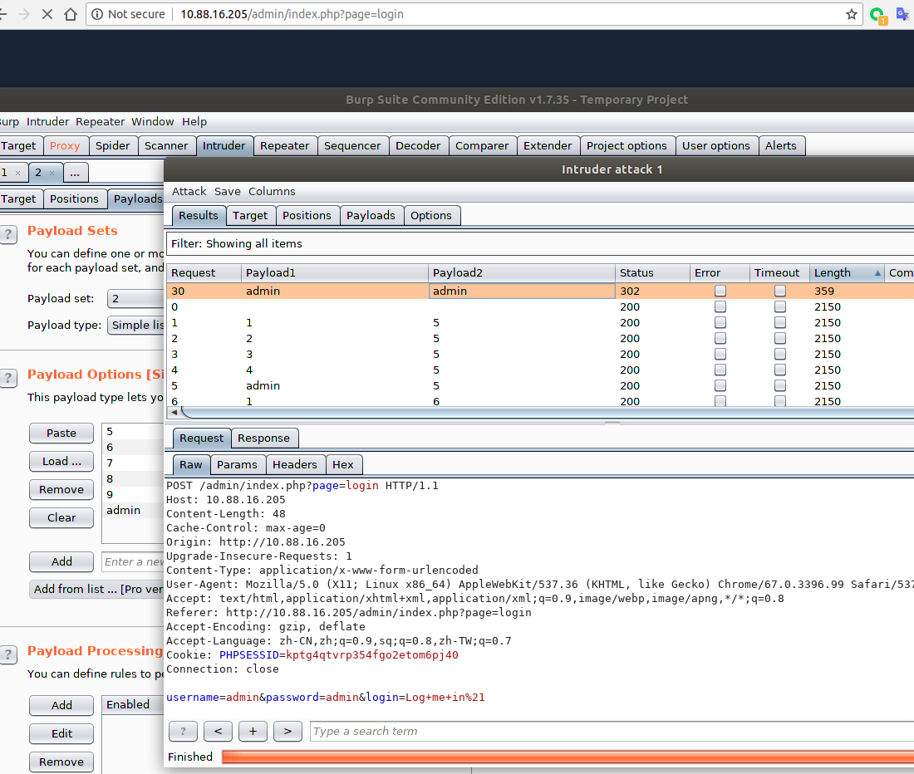
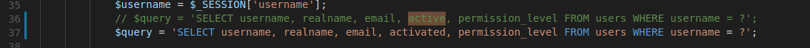
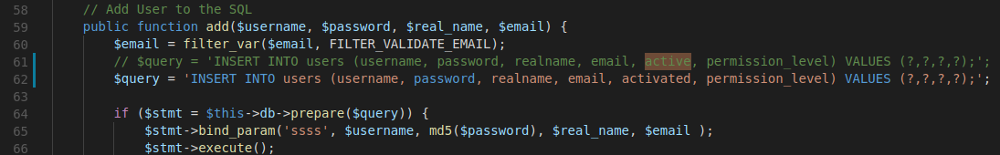
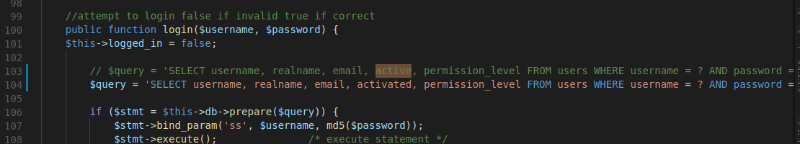

app: https://github.com/ciptard/golemcms 

golemcms 002

attacker can brute the password of the `/admin/index.php` page

0x001 access http://127.0.0.1/admin/index.php and use burpsuite intruder tab

PS: due to the application is not finished complete , there is a bug about login .so if you want to login success ,you should change three words :

`core/classes/GC_User.php`

just change active to activated :) , if you do not think this is OK just close this CVEID request.