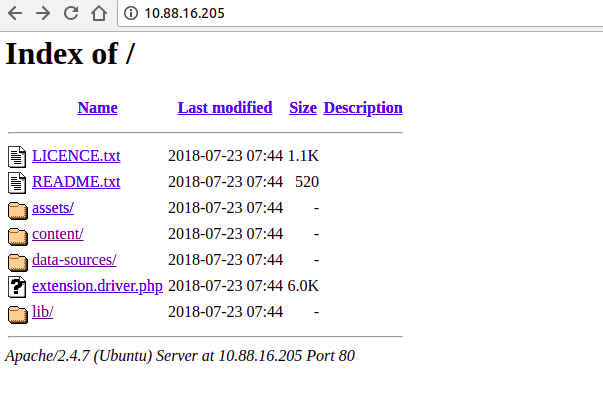

app: https://github.com/ahwayakchih/translationmanager

translationmanager 

Directory Traversal vulnerabilitie in translationmanager v 0.9

0x001 access to `http://ip:port/` you will see:

0x002 another directory `http://ip:port/content/`:

