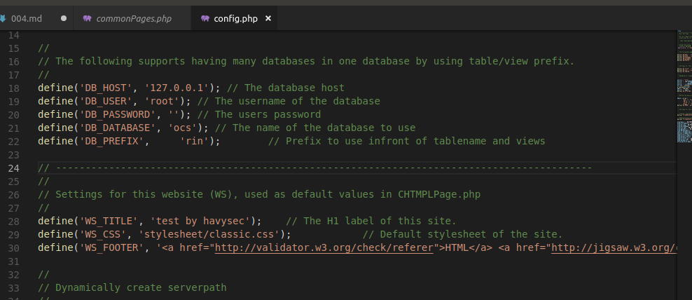
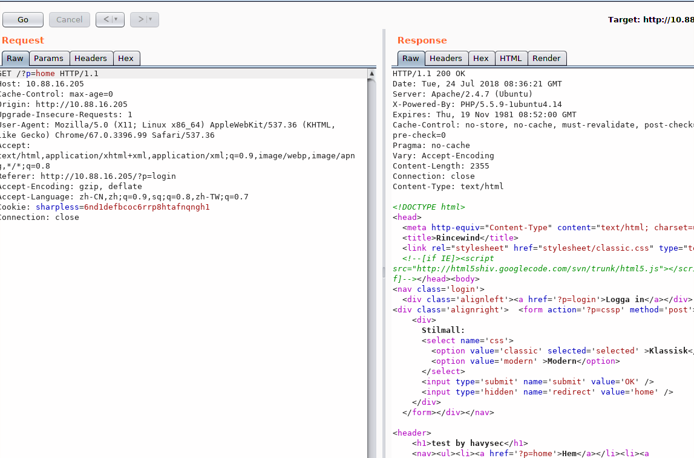

app: https://github.com/sharpless/rincewind

a brute force attack bypassing authentication vulnerability because the parameter `p` of `index.php` and another file named `commonPages.php` can help `login` the app and there do not have a captcha in rincewind cms before 2011-2-20  

0x001 first Setting up Test Environment 

* php
* mysql
* apache2
* ubuntu
  

To install:

1) Download the zip-file, or clone the repository
2) Copy config-template.php to config.php
3) Edit config.php to match your database settings
4) Optional: add or remove links in the $meny-array
5) Change WS_TITLE to whatever you like
6) Create the database you want to use, if it doesn't exist
7) Go to the ?p=install page on the site.

0x002 brute force authentication

choose `Ja` and Click `Installera` the database will be reset by default sql data of folder `sql/*.php`

use burpsuite to intercept the post request of login page

send the request to `Intruder` and the userename password must inclued correct value `mikael` and `hemligt` 

start attack

follow the redirection to login success

